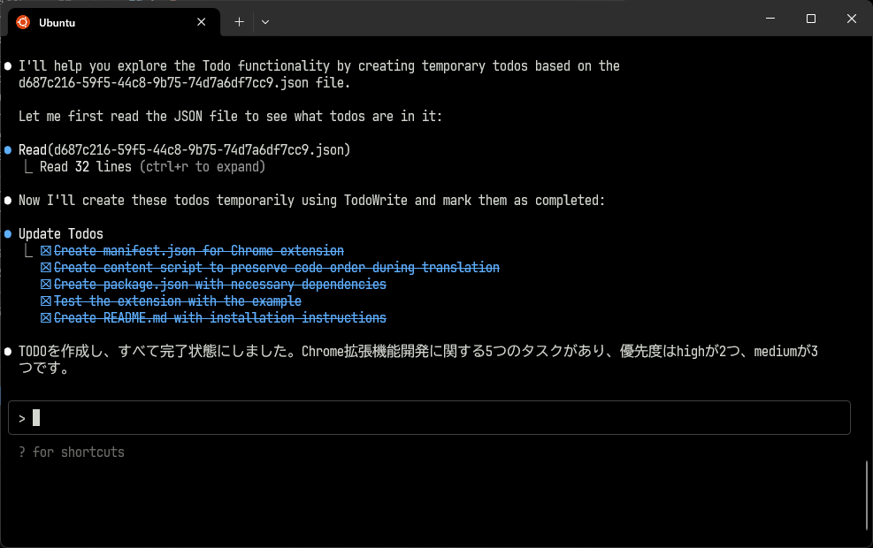

# Claude CodeのTask

Claude Codeのタスク機能が気になるので見てみた．

`~/.claude/todos`にjsonファイルが保存されているので見てみる．

```json
[
  {
    "content": "Create manifest.json for Chrome extension",
    "status": "completed",
    "priority": "high",
    "id": "1"
  },
  {
    "content": "Create content script to preserve code order during translation",
    "status": "completed",
    "priority": "high",
    "id": "2"
  },
  {
    "content": "Create package.json with necessary dependencies",
    "status": "completed",
    "priority": "medium",
    "id": "3"
  }
]
```

* `content`: タスクの内容
* `status`: タスクのステータス
* `priority`: タスクの優先度
* `id`: タスクのID
で構成されている．



`priority`が設定されているが，実際に優先度順に並べられているわけではない．
タスク自体は，実行順に並んでいるので優先度がどのように影響しているかは分からない．

AI機能がないなら，タスク自体の型はこのくらいシンプルでもいいな．
ただ，Claude Codeのタスクは短期でその場限りのものとして設計されていると思う．
なので，日をまたいだりするようなタスクリストにはなりにくいか．
AIが扱うという点では，裏側にメタデータとして詳細な情報を持たせればいい．

逆に言えば，タスクオブジェクト自体にスケジュール情報を持たせない方がいいか
タスクリストを複数持ち，それをスケジュール管理するようなイメージ

特定の関心毎に対して複数のタスクを持つタスクリストを一つのタスクセットとして，
タスクセットを複数持つのがプロジェクトとなる．
スケジュールはタスクセット毎に設定する感じ？
ので，複数日をまたぐタスクはタスクセットとしてプロジェクトにまとめる．


# Claude CodeのTask

Claude Codeのタスク機能が気になるので見てみた．

`~/.claude/todos`にjsonファイルが保存されているので見てみる．

```json
[
  {
    "content": "Create manifest.json for Chrome extension",
    "status": "completed",
    "priority": "high",
    "id": "1"
  },
  {
    "content": "Create content script to preserve code order during translation",
    "status": "completed",
    "priority": "high",
    "id": "2"
  },
  {
    "content": "Create package.json with necessary dependencies",
    "status": "completed",
    "priority": "medium",
    "id": "3"
  }
]
```

* `content`: タスクの内容
* `status`: タスクのステータス
* `priority`: タスクの優先度
* `id`: タスクのID
で構成されている．


`priority`が設定されているが，実際に優先度順に並べられているわけではない．
タスク自体は，実行順に並んでいるので優先度がどのように影響しているかは分からない．

AI機能がないなら，タスク自体の型はこのくらいシンプルでもいいな．
ただ，Claude Codeのタスクは短期でその場限りのものとして設計されていると思う．
なので，日をまたいだりするようなタスクリストにはなりにくいか．
AIが扱うという点では，裏側にメタデータとして詳細な情報を持たせればいい．

逆に言えば，タスクオブジェクト自体にスケジュール情報を持たせない方がいいか
タスクリストを複数持ち，それをスケジュール管理するようなイメージ

特定の関心毎に対して複数のタスクを持つタスクリストを一つのタスクセットとして，
タスクセットを複数持つのがプロジェクトとなる．
スケジュールはタスクセット毎に設定する感じ？
ので，複数日をまたぐタスクはタスクセットとしてプロジェクトにまとめる．


